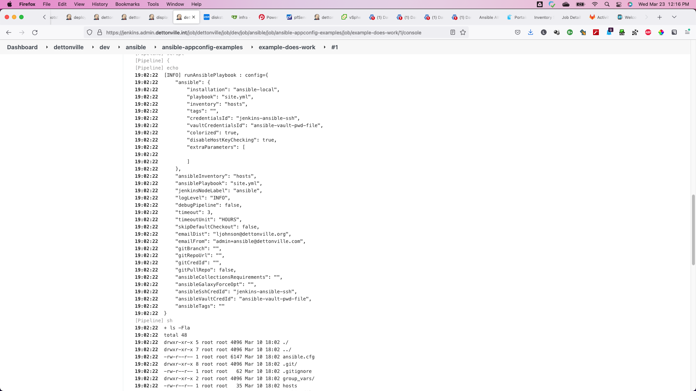
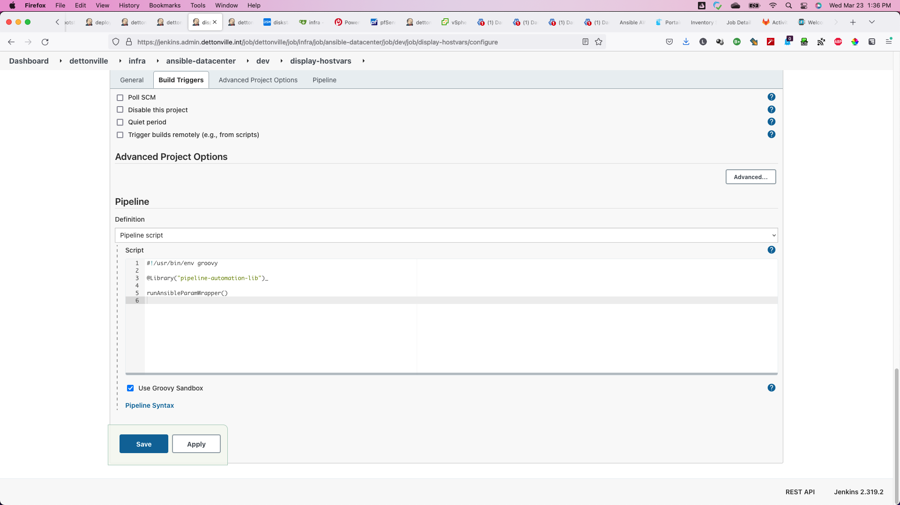
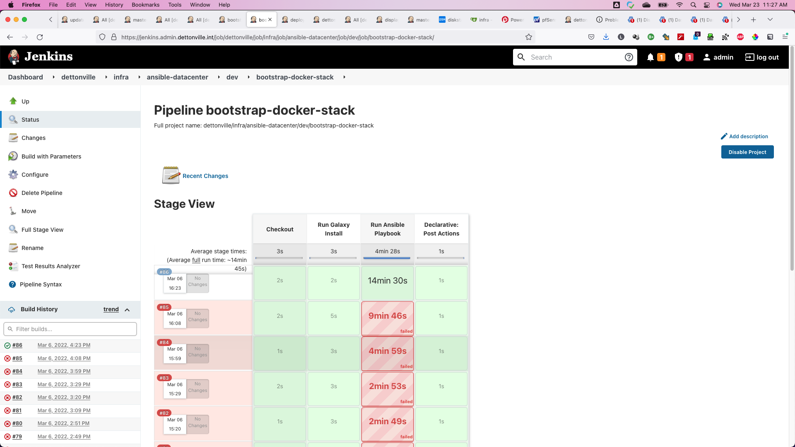

[](LICENSE)

# Jenkins Pipeline Automation Library

The jenkins enabled docker image used in examples here can be found on [dockerhub](https://hub.docker.com/repository/docker/lj020326/docker-jenkins).  

The jenkins-agent enabled docker images used in examples here can be found on [dockerhub](https://hub.docker.com/repository/docker/lj020326/jenkins-docker-cicd-agent).  

## Key Concepts

The pipeline library was developed with a focus to ease build processes which have a more or less similar project structure e.g.
* VMware Vsphere
* Ansible Automation
* Openshift
* Kubernetes
* Pivotal PCF
* Maven/Java
* local Artifact Server (e.g., Sonatype Nexus or Artifactory)
* GIT (e.g., gitlab, gitea)

The assumption is that in these environments

* Jenkins has a dedicated user account to checkout code (or one per project)
* the artifact server caches public artifacts and acts as a internal artifact server

So why configure maven repositories and scm credentials in every pipeline?

So the key concepts of the pipeline enable you to
* Auto provide credentials (no worries, only Jenkins credential ids, not the credential itself) (see [Credentials](docs/credentials.md))
* Auto provide maven settings (see [ManagedFiles](docs/managed-files.md))
* configure each job the same way (see [ConfigStructure](docs/config-structure.md))
* log and see the things you are interested in (see [Logging](docs/logging.md)) to builds.

Running this pipeline library will result in more structured and easier to maintain pipeline scripts.

Looking for an example on how a pipeline script looks like when using Pipeline? Have a look at [Usage examples](docs/pcfBuildDeployMvn.md)

### Library Setup

Have a look at the [pipeline setup tutorial](./docs/tutorial-setup-library.md) to configure and start using the shared pipeline library.

This a Jenkins library built to make it easier to configure build-deploy pipelines without necessarily knowing about Jenkinsfile syntax.

When using this library, your Jenkinsfile should look something like this:

```groovy
#!/usr/bin/env groovy

@Library('pipeline-automation-library')

Map config = [:]

buildVmTemplate(config)

```

The example above loads the library, and calls the shared `buildVmTemplate` pipeline used to build vm templates for vmware vsphere, kvm, virtualbox, hyperv, and other possible hypervisor environments.


## Jenkins Pipeline Usage

### Setup pipeline automation library used by all jenkins jobs
Configure the library in jenkins as seen below.


## Pipelines Available

Some of the most often used pipelines in this library include:

* Run Ansible Playbook
  * [runAnsibleParamWrapper](./vars/runAnsibleParamWrapper.groovy) - used by pipelines within a defined node hierarchy (e.g., environment and tag) to collect node parameters to start the common [ansible playbook job](./vars/runAnsiblePlaybook.groovy).<br>
    See [here](https://github.com/lj020326/ansible-datacenter/blob/main/README.md) for document explaining example setup and usage of this pipeline.<br>
  * [runAnsibleDevJob](./vars/runAnsibleDevJob.groovy) - used to develop ansible playbooks against a branch of the ansible source repo.
* Build Vm Template
  * [buildVmTemplate](./vars/buildVmTemplate.groovy) - pipeline used to build vm templates for vmware vsphere, kvm, virtualbox, hyperv, and other possible hypervisor environments.<br>
    See [here](https://github.com/lj020326/packer-templates/blob/main/README.md) for document explaining example setup and usage of this pipeline.
* Build Docker Image
  * [buildDockerImage](./vars/buildDockerImage.groovy) - pipeline used to build docker images<br>
    See [Jenkinsfile here for advanced example with multiple-image dependencies](https://github.com/lj020326/jenkins-docker-agent/blob/master/Jenkinsfile).
* Run Connectivity Test 
  * [runConnectivityTest](./vars/runConnectivityTest.groovy) - pipeline used run connectivity tests from the specified jenkins nodes.<br>
    This is mainly used by jenkins admin to verify connectivity from any/all specified jenkins nodes to the specified endpoints.<br>
    See more detailed information [here](./docs/runConnectivityTest.md) for how to use.
* Run Application Test Harness 
  * [runATH](./vars/runATH.groovy) - pipeline used by CICD build process at the test phases (e.g., Integration/Automation/QA testing using selenium/etc).<br>
    See more detailed information [here](./docs/runATH.md) for how to use.
* Run App Deployment Pipeline
  * [runAppDeployEnvJob](./vars/runAppDeployEnvJob.groovy) - used to deploy maven java application.
  * [pcfBuildDeployMvn](./vars/pcfBuildDeployMvn.groovy) - used to build and deploy maven java application.<br>
    See more detailed information [here](./docs/pcfBuildDeployMvn.md) for how to use.
  * [pcfBuildDeployGradle](./vars/pcfBuildDeployGradle.groovy) - used to build and deploy maven java application.<br>
    See more detailed information [here](./docs/pcfBuildDeployGradle.md) for how to use.
  * [runPcfDeploy](./vars/runPcfDeploy.groovy) - used to deploy maven application to PCF 

## Build and Deploy Spring Boot apps to PCF

See the [pivotal pcf section](./docs/pivotal-pcf.md) for details.


### Pipeline Screen snaps








[ansible-datacenter-3d-bootstrap-linux-console](./docs/screenshots/ansible-datacenter-3d-bootstrap-linux-console.md)




## Contact

[](https://www.linkedin.com/in/leejjohnson/)
