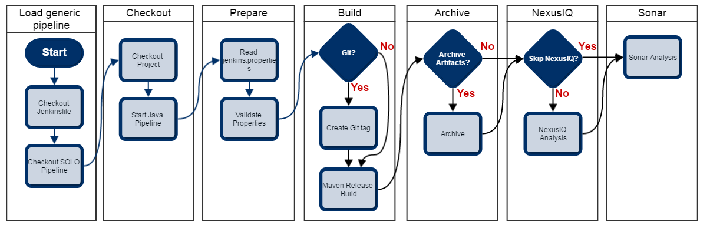
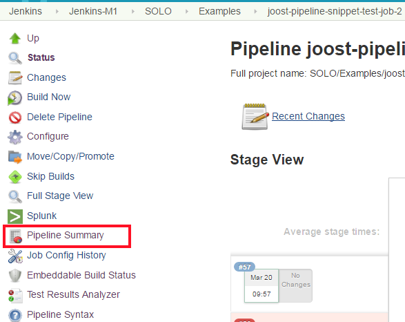
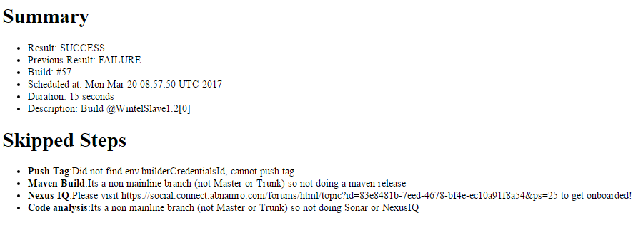

# Java Pipeline

1. [Requirements](#Requirements)
1. [OnBoarding](#OnBoarding)
1. [Pipeline Flow](#Pipeline-Flow)
1. [Pipeline Steps](#Pipeline-Steps)

## 1. Requirements <a name="Requirements"></a>

### pom.xml
* pom.xml in the root
* pom.xml contains the property *application.code*

### Nexus configuration

The pipeline expects that everything that is required to build the application is found in the {NexusBaseUrl}/{NexusVersionPathToRepository}{CODE}-group repository.

### Jenkins configuration

* Use Jenkins Folders to separate application
* Use technical users for tool integrations, available by {applicationCode}_BUILDER

## 2. OnBoarding <a name="OnBoarding"></a>

### Files to add

You have to add at least two files:

* Jenkinsfile
* jenkins.properties

#### Jenkinsfile
````groovy
@Library(['github.com.dettonville.api.oesd/dcapi-automation-pipeline']) _
javaPipeline()
 ````

#### jenkins.properties example
```properties
jdkVersion=1.8
publishJavaDoc=true
javaDocBuildTargets=javadoc:aggregate -s settings.xml
publishJUnit=true
archiveFiles=true
archiveFilesSet=**/*.ps1;**/target/*.jar
applicationCode=SOLO
```

## Parameters in jenkins.properties

| Name                       | Default     | Description |
| -------------------------- | ----------- | ----------- | 
|**jdkVersion**              | 1.7         | the JDK version to use as tool jdk, the version will be mapped to the actual name in Jenkins|
|**mavenVersion**            | 3.3.3       | the maven version to use as tool maven, will be mapped to the actual name in Jenkins |
|**buildTargets**            |             | if the default build requires additional maven parameters (-DreleaseVersion=${version} -DdevelopmentVersion=${pom.version} -DpushChanges=false -DlocalCheckout=true -DpreparationGoals=initialize clean release:clean release:prepare release:perform -B -s settings.xml) |
|**publishJavaDoc**          | false       | if the JavaDoc should be generated |
|**javaDocBuildTargets**     |             | if the JavaDoc should have additional maven targets: javadoc:aggregate -s settings.xml |
|**javaDocFolder**           | target/site | where the JavaDoc files are to be found |
|**publishJUnit**            | false       | if we should publish JUnit results|
|**snapshotDeployTarget**    |             | if branch builds need additional maven targets: clean deploy -B -s settings.xml|
|**archiveFiles**            | false       | if we need to archive files|
|**archiveFilesSet**         |             | **;** separated list of files that to be archived|
|**applicationCode**         |             | application identifier, used to derive certain things from |
|**settingsXmlInWorkspace**  | false       | if the settings.xml is already in the root of your project|
|**copySettingsXmlFromJob**  | false       | if we need to copy the settings.xml from a job: either false or the job name |
|**sonarQubeWithRunner**     | false       | if true, will create a sonarqube properties file before running the analysis with a sonarqube runner |
|**sonarInstallation**       |             | when not using the runner, we need to know which sonarqube configuration to use |
|**mavenPublishUrl**         |             | maven repository url for publishing artifact (with maven release plugin) |
|**mavenMirrorUrl**          |             | maven repository url for using as a mirror from where all required artifacts can be downloaded |

## 3. Pipeline Flow <a name="Pipeline-Flow"></a>

The pipeline makes a distinction between a mainline build and a branch build.
Mainline is **main** in the case of *Git* or **trunk** in the case of *Subversion*. 

### Mainline

* Prepare Tag 
* Prepare Settings.xml (based upon the jenkins.properties *applicationCode* property)
* Do a Maven release build (mvn release:prepare release:perform)
    * build an artifact with a release version (strips -SNAPSHOT) and uploads this to Nexus
    * pushes the tag to the repository (SVN or Git)
* Do a Sonar Analysis
* ~~Do a NexusIQ Analysis~~ (removed from flow)
* If required, archive files

### Non-Mainline

* Prepare Tag?
* Prepare Settings.xml (based upon the jenkins.properties *systemLetterCode* property)
* Do a Maven deploy build (mvn deploy -s settings.xml)

### Detail Flow


## Pipeline Steps <a name="Pipeline-Steps"></a>

The following pipeline-steps are implemented:
 * Load generic pipeline
 * Checkout (Bitbucket / SVN)
 * Prepare
 * Build
 * Archive
 * ~~NexusIQ analysis~~
 * Sonar
 
### 0. Have a pipeline job
  
The pipeline assumes you're using a [Multi-Branch Pipeline](https://jenkins.io/blog/2015/12/03/pipeline-as-code-with-multibranch-workflows-in-jenkins/) job.
This can be the direct use of the Multi-Branch Pipeline job type or a wrapper such as [BitBucket Team/Project](https://wiki.jenkins-ci.org/display/JENKINS/Bitbucket+Branch+Source+Plugin).
  
 
### 1. Load generic pipeline
 
As the Java pipeline is something we want standardized and reused as much as is possible, we need a generic pipeline code.
And the first step for any pipeline should be to download this reusable code. 
We do this via a git checkout and a Pipeline DSL *load* action. See the example below (exceprt from a Jenkinsfile). 
 
 ````java
@Library(['stpl-pipeline-core','stpl-pipeline-java']) _
javaPipeline('docker') // param is buildSlave label
 ````

### 2. Checkout (BitBucket / SVN)
 
The first thing the generic pipeline does, is checkout your code. 
This is because the initial checkout, only checks out your Jenkinsfile.
 
As you're using the Multi-Branch Pipeline job, a checkout in the pipeline can be done via a shorthand *checkout scm*.
This means that no matter if you've configured a BitBucket or subversion (SVN) repository, the pipeline will work.
  
### 3. Prepare Build Configuration

Before we can build the application, we need to prepare the build configuration.
We have to know if we're dealing with a mainline build (trunk/main), what is your maven/java version and any pipeline parameters you have configured in the jenkins.properties file.

Once this is done, we can execute the appropriate build.

### 4. Build

If your build is on a mainline (main or trunk branch) it will do a *maven release* (see 4.b) and create a tag.
If you're using Git, it will only push your tag. If you use SVN it will also update the version of your pom.xml as you'd expect from a maven release.

If your build is not on a mainline it will do a *mvn deploy* (see 4.c) and use it can upload a snapshot build.

#### 4.a settings.xml

Before the build gets executed, a generic settings.xml is generated.
The assumption is that your maven mirror url (set with mavenMirrorUrl) contains all your required dependencies.

#### 4.b maven release

For releasing, we assume that you have distributionManagement configured where ${applicationCode}-release and ${applicationCode}-snapshots refer to your hosted repositories.

And that your ${applicationCode}_BUILDER credentials can write to this.

For how a maven release works, please read the [documention from maven](http://maven.apache.org/maven-release/maven-release-plugin/).
We do a [release:prepare](http://maven.apache.org/maven-release/maven-release-plugin/examples/prepare-release.html) followed by a [release:perform](http://maven.apache.org/maven-release/maven-release-plugin/examples/perform-release.html) with specific development and release versions.

For GIT:

* Assumption: your version is Major.Minor.Patch-SNAPSHOT
* End result: 
    * artifact in nexus with Major.Minor.Patch-{BUILD_NUMBER}
    * tag in bitbucket with vMajor.Minor.Patch-{BUILD_NUMBER}
    * the pom.xml remains unaffected, manage versions yourself!

For SVN:

* Assumption: your version is Major.Minor-SNAPSHOT
* End result: 
    * artifact in nexus with Major.Minor.Patch-{BUILD_NUMBER}
    * tag in svn with {ArtifactId}-Major.Minor.Patch-{BUILD_NUMBER}
    * pom.xml in current branch is ?? (TODO: figure this out)

#### 4.c maven deploy
  
Assumption: your version is Major.Minor.Patch-SNAPSHOT

The build will then do a *maven deploy* (mvn deploy) and upload your snapshot to Nexus.

    
### 5. Archive

For some cases you might want certain files to be available after a build. 
With Pipelines, your job's workspace doesn't get saved and is inaccesible, these files to be archived.
In your pipeline UI you will see a download link next to the build number information.

You can supply a space separated list of files to archive.
Please check the archive artifact in the Jenkins Pipeline Syntax (Link at left hand side of any Jenkins Pipeline job) for more information on how to specify file matchers.

### 6. Sonar

If you have SonarQube 5.2+ and updated Jenkins plugins, we can do the following:

```groovy
withSonarQubeEnv("MySonarQubeConfigId") {
    sh "mvn sonar:sonar -Dsonar.links.ci=${env.BUILD_URL}"
}
```

For more information, please read [the documentation here](https://docs.sonarqube.org/display/SCAN/Analyzing+with+SonarQube+Scanner+for+Maven).

If that is not the case, set property **PLACEHOLDER** to true and the pipeline read the information from your pom.xml (groupId, artifactId, version, name).
And then start a analysis via [SonarQube Scanner](https://docs.sonarqube.org/display/SCAN/Analyzing+with+SonarQube+Scanner).

### 7. Summary

Once the pipeline has finished it will generate a summary html page to clarify the pipeline build.
It will summarize the status, build time and similar attributes and list any pipeline step that was skipped for any reason.

These skipped steps could be a deliberate skipping of NexusIQ analysis or an skipping of a Git Tag due to a missing variable.

You can find the summary report in the build page on the left hand side "Pipeline Summary".



#### Summary Report Example

