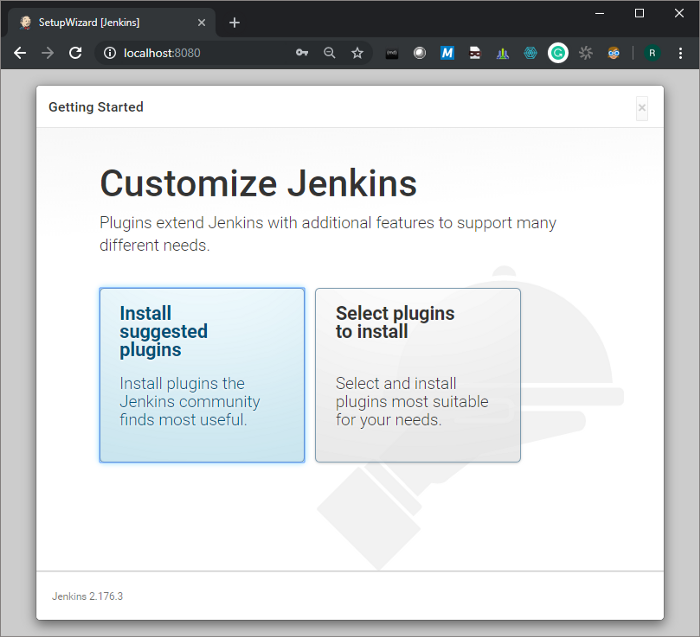

# Quickstart CI with Jenkins and Docker-in-Docker


Run everything inside Docker containers, even Docker itself

**_tldr:_** If you just want to get going quickly: we use Jenkins to automate Continuous Integration tasks, and run it in a Docker container so its super-easy to setup and maintain. We also use Docker to run parts of the CI pipeline (such as builds or testing), with the CloudBees Docker Custom Build Environment plugin. Here, with a single command, we spin up a Docker container that contains Jenkins and the Docker executable, and connect it to the host daemon to avoid any conflicts:

```
docker run -it -p 8080:8080 -p 50000:50000 \    -v jenkins_home:/var/jenkins_home \    -v /var/run/docker.sock:/var/run/docker.sock \    --restart unless-stopped \    4oh4/jenkins-docker
```

This assumes you have Docker already installed on the host machine, and are running Linux (tested on Ubuntu).

We use a custom Dockerfile to add the Docker executable to the standard Jenkins LTS image. All code is here:

If you’d like to understand a bit more about the detail, here’s the long version. In this tutorial we will go through:

1.  Continuous integration and Docker
2.  Running Docker inside a Docker container
3.  Running Jenkins inside a Docker container
4.  Installing the CloudBees Docker Custom Build Environment plugin
5.  Setting up a job

It assumes a basic familiarity with the concept of containerisation (e.g. using Docker). It also doesn’t go into much detail on setting up your Jenkins pipeline — that is probably quite specific to your use case and toolchain. There are lots of good articles and videos out there if you need to learn more.

## Continuous Integration

Jenkins is a great tool for automating Continuous Integration. It integrates with common source code management (SCM) tools like Git and Subversion, and you can use it do run tasks such as compiling code or running unit tests. You can even set it up to notify you via email or Slack/Microsoft Teams with its progress.

## Docker

[Docker](https://www.docker.com/) is another useful tool: it lets you create an isolated ‘container’ — a bit like a virtual machine — that you can run code in, and then discard when you are done. Containers are useful for running testing inside, as you can control exactly which software components are present/not present inside.

If you need to install Docker on your host machine, follow these instructions: [https://docs.docker.com/install/](https://docs.docker.com/install/)

You can also run Jenkins inside a Docker container, and using a pre-built image saves having to configure the dependencies. In this case though, what happens when you want to create a new container for you test or build environment? You can have another instance of Docker running inside the Jenkins container, although some specific configuration is recommended.

## **Docker in Docker**

Its possible to run into some problems with Docker running inside another Docker container ([more info here](https://jpetazzo.github.io/2015/09/03/do-not-use-docker-in-docker-for-ci/)). A better approach is that a container does not run its own Docker daemon, but connects to the Docker daemon of the host system. That means, you will have a Docker CLI in the container, as well as on the host system, but they both connect to one and the same Docker daemon. At any time, there is only one Docker daemon running in your machine, the one running on the host system. This [article from Daniel Weibel](https://itnext.io/docker-in-docker-521958d34efd) really helped me understand this. To do this, you just bind mount to the host system daemon, using this argument when you run Docker:

`-v /var/run/docker.sock:/var/run/docker.sock`

It is also [recommended](https://github.com/jenkinsci/docker/blob/master/README.md) to create an explicit volume on the host machine, that will survive the container stop/restart/deletion. Use this argument when you run Docker:

`-v jenkins_home:/var/jenkins_home`

So, here’s the full command to spin up a Docker container with Jenkins and Docker already inside. The easiest way is to pull the image direct from Docker Hub:

```
docker run -it -p 8080:8080 -p 50000:50000 \    -v jenkins_home:/var/jenkins_home \    -v /var/run/docker.sock:/var/run/docker.sock \    --restart unless-stopped \    4oh4/jenkins-docker
```

It’s worth being clear about what’s happening under the hood when downloading and running public Docker images, especially if you are providing access to resources on the host machine. The [Dockerfile](https://github.com/4OH4/jenkins-docker/blob/master/Dockerfile) takes the current, official Jenkins long term support (LTS) Docker image, installs Docker CE inside, and adds the `jenkins` user to the `docker` group.

As an alternative to pulling the pre-built image, you could instead clone the [repository](https://github.com/4OH4/jenkins-docker), build the image yourself from the Dockerfile, and then run the container:

```
git clone https://github.com/4OH4/jenkins-docker.gitcd jenkins-dockerdocker build -t jenkins-docker .docker run -it -p 8080:8080 -p 50000:50000 \    -v jenkins_home:/var/jenkins_home \    -v /var/run/docker.sock:/var/run/docker.sock \    --restart unless-stopped \    jenkins-docker 
```

The `run` command also exposes two ports to the host machine (port 8080 is the one that you will use to access the web browser interface), and tells the daemon to keep the container running unless stopped.

Once the required components have downloaded and the container started, you should see the following message in the console.

```
*************************************************************************************************************************************************************************************Jenkins initial setup is required. An admin user has been created and a password generated.Please use the following password to proceed to installation:04b6774ef3634c25a70692c209f1d018This may also be found at: /var/jenkins_home/secrets/initialAdminPassword***************************************************************************************************************************************************************************************
```

Open your web browser and navigate to [http://localhost:8080](http://localhost:8080/) to continue setup:


Jenkins login

## Jenkins configuration

The interface should guide you through the initial setup, including creating the first user. Most people can choose the `Install suggested plugins` option for a default configuration:



Jenkins configuration

Once setup is complete, you should be at the Dashboard screen of the management console. Here you can create jobs and review their status, as well as configure the system. For more info have a look at the [documentation](https://jenkins.io/doc/book/getting-started/).

## CloudBees Docker Custom Build Environment plugin

The CloudBees plugin makes it easy to create a custom build environment using a Docker container. You can fine-tune the configuration of your build environment using a Dockerfile. Currently, I’m doing a lot of work in Python, so use the [Anaconda Python 3](https://hub.docker.com/r/continuumio/anaconda3) image (or [Miniconda](https://hub.docker.com/r/continuumio/miniconda3/dockerfile)) as the base for my Dockerfile, and add any required custom dependencies.

To install, from the web management interface click `Manage Jenkins > Manage Plugins > Available` and search for the plugin:


Jenkins Plugin Manager

Hit the checkbox, and then `Install without restart`. The plugin will install in the next few minutes.

## Creating a job

From the Jenkins Home screen, click `New Item`. Jenkins will then ask for the project name, and the type of job you want — this will likely vary by application, although a `Freestyle project` is probably a good first choice if you aren’t sure.


Jenkins Dashboard Home

A common use case is to checkout code from a SCM repository, before running build/test operations on the code. You can configure all of that, as well as build triggers (e.g. run when the code changes, or on a fixed schedule) and post-build actions (e.g. report results) on the `Job > Configure` screen. You also have the option to define the build environment. This is where we specify the Docker container we want to use — if you have a custom Dockerfile this could reside in the repository, or be drawn from somewhere else:


Configuring the Jenkins build environment

You’ll also need to specify the actual actions the job should take, of course! You can do that by adding build steps, such as executing shell commands. It's a good idea to run the job manually and check the output to make sure it matches your expectations `Jenkins Home > project_name > Build Now:`


Jenkins job status — the last build completed successfully

Click the build name/number (`#1`) in the `Build History` to see the results and output.

That brings us to the end of this tutorial. Hopefully this shows how you can very quickly get a Jenkins CI pipeline up and running very quickly using Docker. There a few links to further reading at the bottom.

What are your thoughts? Have you used Jenkins and Docker in your work? Leave your comments below!

> [_Lee Johnson_](https://www.linkedin.com/in/leejjohnson/) _is a technology consultant specialising in platform automation, and data-driven products._ [_@leejjohnson_](https://www.linkedin.com/in/leejjohnson/)
> [_Lee Johnson_](https://twitter.com/lj020326) _technology consultant_ [_@lj020326_](https://twitter.com/lj020326)

## Reference

* https://medium.com/swlh/quickstart-ci-with-jenkins-and-docker-in-docker-c3f7174ee9ff
* 