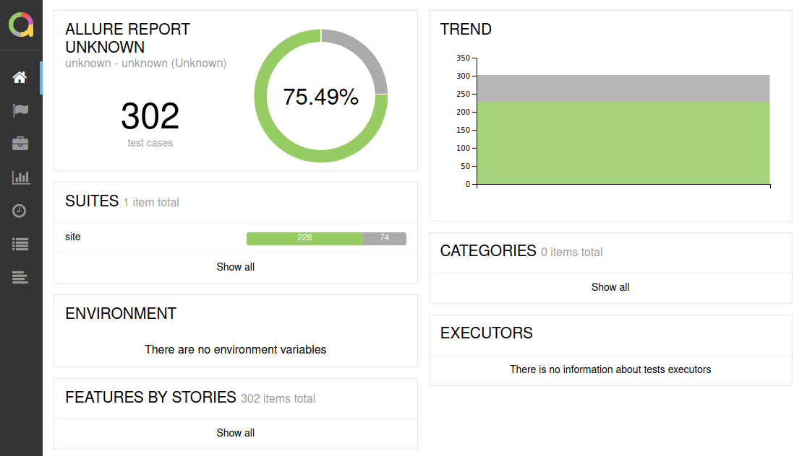

# How to store and visualize playbook events

Use [JUnit](https://junit.org/) callback plugin to store and [Allure Framework](https://docs.qameta.io/allure/) to visualize ansible playbook events.

### Ansible

JUnit callback plugin requires `junit_xml` Python module.

```shell
[WARNING]: The `junit_xml` python module is not installed. Disabling the `junit` callback plugin.
```

> Install it before using this callback plugin.

```shell
$ sudo apt install python3-junit.xml
```

Use environment variables to use JUnit callback plugin, define output directory and its behaviour.

```shell
$ ANSIBLE_STDOUT_CALLBACK=junit JUNIT_OUTPUT_DIR="junit-results" JUNIT_FAIL_ON_CHANGE=true JUNIT_HIDE_TASK_ARGUMENTS=true ansible-playbook -i inventory/hosts.yml --vault-password-file .vault_pass.txt --check playbooks/site.yml
```

It will create JUnit XML report in defined directory.

```shell
$ ls -l junit-results/
```

```shell
total 512
-rw-rw-r-- 1 milosz milosz 522393 Oct  3 21:49 lxd-1601754580.104396.xml
```

### Allure Framework

Download command-line utility.

```shell
$ wget https://repo.maven.apache.org/maven2/io/qameta/allure/allure-commandline/2.13.6/allure-commandline-2.13.6.tgz
```

Extract it to the `/opt` directory for example.

```shell
$ sudo tar -C /opt -xzf allure-commandline-2.13.6.tgz
```

Generate report locally.

```shell
$ /opt/allure-2.13.6/bin/allure generate junit-results --output junit-reports --clean
```

```shell
Report successfully generated to junit-reports
```

Open report in web-browser.

```shell
$ /opt/allure-2.13.6/bin/allure open junit-reports
```

```shell
Starting web server...
2020-10-03 22:30:19.347:INFO::main: Logging initialized @212ms to org.eclipse.jetty.util.log.StdErrLog
Server started at &lt;http://127.0.1.1:35397/&gt;. Press &lt;ctrl+C&gt; to exit
```

Copy `history` directory from `junit-reports` to `junit-results` to see trends next time.

```shell
$ cp -r junit-reports/history junit-results/
```



### Jenkins

Take advantage of [Jenkins JUnit](https://plugins.jenkins.io/junit/) plugin when using [Jenkins](https://www.jenkins.io/) as it will intsantly provide useful information about test results with minimum configuration required.

### Additional notes

[JUnit callback plugin](https://docs.ansible.com/ansible/latest/collections/ansible/builtin/junit_callback.html) definition.

See [Allure 2.6.0 is not able to generate history trends](https://github.com/allure-framework/allure2/issues/813) in case of trouble with trends.

## Reference

- https://sleeplessbeastie.eu/2021/01/11/how-to-store-and-visualize-playbook-events/
