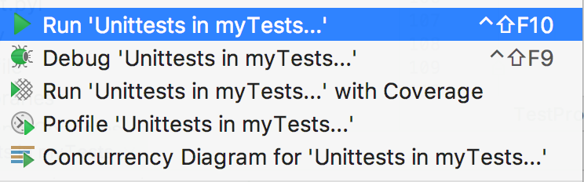
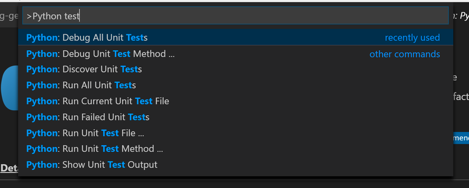
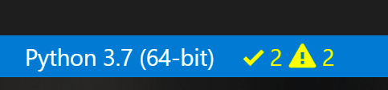
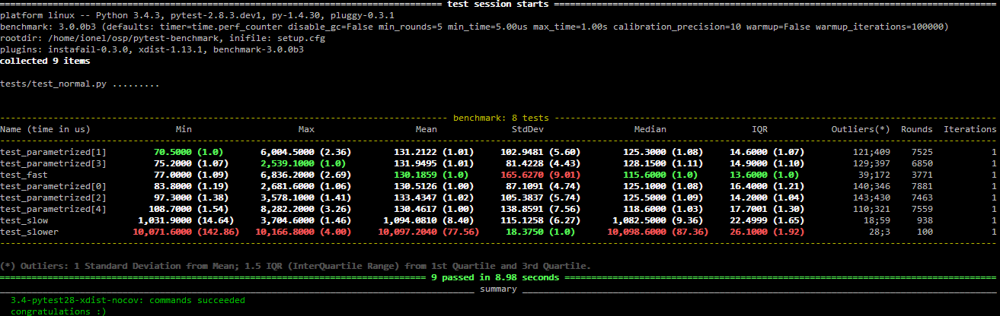

# Getting Started With Testing in Python

This tutorial is for anyone who has written a fantastic application in Python but hasn’t yet written any tests.

Testing in Python is a huge topic and can come with a lot of complexity, but it doesn’t need to be hard. You can get started creating simple tests for your application in a few easy steps and then build on it from there.

In this tutorial, you’ll learn how to create a basic test, execute it, and find the bugs before your users do! You’ll learn about the tools available to write and execute tests, check your application’s performance, and even look for security issues.

## Testing Your Code

There are many ways to test your code. In this tutorial, you’ll learn the techniques from the most basic steps and work towards advanced methods.

### Automated vs. Manual Testing

The good news is, you’ve probably already created a test without realizing it. Remember when you ran your application and used it for the first time? Did you check the features and experiment using them? That’s known as **exploratory testing** and is a form of manual testing.

Exploratory testing is a form of testing that is done without a plan. In an exploratory test, you’re just exploring the application.

To have a complete set of manual tests, all you need to do is make a list of all the features your application has, the different types of input it can accept, and the expected results. Now, every time you make a change to your code, you need to go through every single item on that list and check it.

That doesn’t sound like much fun, does it?

This is where automated testing comes in. Automated testing is the execution of your test plan (the parts of your application you want to test, the order in which you want to test them, and the expected responses) by a script instead of a human. Python already comes with a set of tools and libraries to help you create automated tests for your application. We’ll explore those tools and libraries in this tutorial.

### Unit Tests vs. Integration Tests

The world of testing has no shortage of terminology, and now that you know the difference between automated and manual testing, it’s time to go a level deeper.

Think of how you might test the lights on a car. You would turn on the lights (known as the **test step**) and go outside the car or ask a friend to check that the lights are on (known as the **test assertion**). Testing multiple components is known as **integration testing**.

Think of all the things that need to work correctly in order for a simple task to give the right result. These components are like the parts to your application, all of those classes, functions, and modules you’ve written.

A major challenge with integration testing is when an integration test doesn’t give the right result. It’s very hard to diagnose the issue without being able to isolate which part of the system is failing. If the lights didn’t turn on, then maybe the bulbs are broken. Is the battery dead? What about the alternator? Is the car’s computer failing?

If you have a fancy modern car, it will tell you when your light bulbs have gone. It does this using a form of **unit test**.

A unit test is a smaller test, one that checks that a single component operates in the right way. A unit test helps you to isolate what is broken in your application and fix it faster.

You have just seen two types of tests:

1.  An integration test checks that components in your application operate with each other.
2.  A unit test checks a small component in your application.

You can write both integration tests and unit tests in Python. To write a unit test for the built-in function [`sum()`](https://realpython.com/python-sum-function/), you would check the output of `sum()` against a known output.

For example, here’s how you check that the `sum()` of the numbers `(1, 2, 3)` equals `6`:

```python
>>> assert sum([1, 2, 3]) == 6, "Should be 6"
```

This will not output anything on the REPL because the values are correct.

If the result from `sum()` is incorrect, this will fail with an `AssertionError` and the message `"Should be 6"`. Try an assertion statement again with the wrong values to see an `AssertionError`:

```python
>>> assert sum([1, 1, 1]) == 6, "Should be 6"
Traceback (most recent call last):
  File "<stdin>", line 1, in <module>
AssertionError: Should be 6
```

In the REPL, you are seeing the raised `AssertionError` because the result of `sum()` does not match `6`.

Instead of testing on the REPL, you’ll want to put this into a new Python file called `test_sum.py` and execute it again:

```python
def test_sum():
    assert sum([1, 2, 3]) == 6, "Should be 6"

if __name__ == "__main__":
    test_sum()
    print("Everything passed")
```

Now you have written a **test case**, an assertion, and an entry point (the command line). You can now execute this at the command line:

```shell
$ python test_sum.py
Everything passed
```

You can see the successful result, `Everything passed`.

In Python, `sum()` accepts any iterable as its first argument. You tested with a list. Now test with a tuple as well. Create a new file called `test_sum_2.py` with the following code:

```python
def test_sum():
    assert sum([1, 2, 3]) == 6, "Should be 6"

def test_sum_tuple():
    assert sum((1, 2, 2)) == 6, "Should be 6"

if __name__ == "__main__":
    test_sum()
    test_sum_tuple()
    print("Everything passed")
```

When you execute `test_sum_2.py`, the script will give an error because the `sum()` of `(1, 2, 2)` is `5`, not `6`. The result of the script gives you the error message, the line of code, and the traceback:

```shell
$ python test_sum_2.py
Traceback (most recent call last):
  File "test_sum_2.py", line 9, in <module>
    test_sum_tuple()
  File "test_sum_2.py", line 5, in test_sum_tuple
    assert sum((1, 2, 2)) == 6, "Should be 6"
AssertionError: Should be 6
```

Here you can see how a mistake in your code gives an error on the console with some information on where the error was and what the expected result was.

> **Note:** It’s possible to simultaneously document and test your code, while ensuring that your code and its documentation remain in sync, with `doctest`. Check out [Python’s doctest: Document and Test Your Code at Once](https://realpython.com/python-doctest/) to learn more.

Writing tests in this way is okay for a simple check, but what if more than one fails? This is where test runners come in. The test runner is a special application designed for running tests, checking the output, and giving you tools for debugging and diagnosing tests and applications.

### Choosing a Test Runner

There are many test runners available for Python. The one built into the Python standard library is called `unittest`. In this tutorial, you will be using `unittest` test cases and the `unittest` test runner. The principles of `unittest` are easily portable to other frameworks. The three most popular test runners are:

-   `unittest`
-   `nose` or `nose2`
-   `pytest`

Choosing the best test runner for your requirements and level of experience is important.

#### `unittest`

`unittest` has been built into the Python standard library since version 2.1. You’ll probably see it in commercial Python applications and open-source projects.

`unittest` contains both a testing framework and a test runner. `unittest` has some important requirements for writing and executing tests.

`unittest` requires that:

-   You put your tests into classes as methods
-   You use a series of special assertion methods in the `unittest.TestCase` class instead of the built-in `assert` statement

To convert the earlier example to a `unittest` test case, you would have to:

1.  [Import](https://realpython.com/absolute-vs-relative-python-imports/) `unittest` from the standard library
2.  Create a class called `TestSum` that inherits from the `TestCase` class
3.  Convert the test functions into methods by adding `self` as the first argument
4.  Change the assertions to use the `self.assertEqual()` method on the `TestCase` class
5.  Change the command-line entry point to call `unittest.main()`

Follow those steps by creating a new file `test_sum_unittest.py` with the following code:

```python
import unittest


class TestSum(unittest.TestCase):

    def test_sum(self):
        self.assertEqual(sum([1, 2, 3]), 6, "Should be 6")

    def test_sum_tuple(self):
        self.assertEqual(sum((1, 2, 2)), 6, "Should be 6")

if __name__ == '__main__':
    unittest.main()
```


If you execute this at the command line, you’ll see one success (indicated with `.`) and one failure (indicated with `F`):

```shell
$ python test_sum_unittest.py
.F
======================================================================
FAIL: test_sum_tuple (__main__.TestSum)
----------------------------------------------------------------------
Traceback (most recent call last):
  File "test_sum_unittest.py", line 9, in test_sum_tuple
    self.assertEqual(sum((1, 2, 2)), 6, "Should be 6")
AssertionError: Should be 6

----------------------------------------------------------------------
Ran 2 tests in 0.001s

FAILED (failures=1)
```

You have just executed two tests using the `unittest` test runner.

> **Note:** Be careful if you’re writing test cases that need to execute in both Python 2 and 3. In Python 2.7 and below, `unittest` is called `unittest2`. If you simply [import](https://realpython.com/python-import/) from `unittest`, you will get different versions with different features between Python 2 and 3.

For more information on `unittest`, you can explore the [unittest Documentation](https://docs.python.org/3/library/unittest.html).

#### `nose`

You may find that over time, as you write hundreds or even thousands of tests for your application, it becomes increasingly hard to understand and use the output from `unittest`.

`nose` is compatible with any tests written using the `unittest` framework and can be used as a drop-in replacement for the `unittest` test runner. The development of `nose` as an open-source application fell behind, and a fork called `nose2` was created. If you’re starting from scratch, it is recommended that you use `nose2` instead of `nose`.

To get started with `nose2`, install `nose2` from PyPI and execute it on the command line. `nose2` will try to discover all test scripts named `test*.py` and test cases inheriting from `unittest.TestCase` in your current directory:

```shell
$ pip install nose2
$ python -m nose2
.F
======================================================================
FAIL: test_sum_tuple (__main__.TestSum)
----------------------------------------------------------------------
Traceback (most recent call last):
  File "test_sum_unittest.py", line 9, in test_sum_tuple
    self.assertEqual(sum((1, 2, 2)), 6, "Should be 6")
AssertionError: Should be 6

----------------------------------------------------------------------
Ran 2 tests in 0.001s

FAILED (failures=1)
```

You have just executed the test you created in `test_sum_unittest.py` from the `nose2` test runner. `nose2` offers many command-line flags for filtering the tests that you execute. For more information, you can explore the [Nose 2 documentation](https://nose2.readthedocs.io/).

#### `pytest`

[`pytest`](https://realpython.com/pytest-python-testing/) supports execution of `unittest` test cases. The real advantage of `pytest` comes by writing `pytest` test cases. `pytest` test cases are a series of functions in a Python file starting with the name `test_`.

`pytest` has some other great features:

-   Support for the built-in `assert` statement instead of using special `self.assert*()` methods
-   Support for filtering for test cases
-   Ability to rerun from the last failing test
-   An ecosystem of hundreds of plugins to extend the functionality

Writing the `TestSum` test case example for `pytest` would look like this:

```python
def test_sum():
    assert sum([1, 2, 3]) == 6, "Should be 6"

def test_sum_tuple():
    assert sum((1, 2, 2)) == 6, "Should be 6"
```

You have dropped the `TestCase`, any use of classes, and the command-line entry point.

More information can be found at the [Pytest Documentation Website](https://docs.pytest.org/en/latest/).

## Writing Your First Test

Let’s bring together what you’ve learned so far and, instead of testing the built-in `sum()` function, test a simple implementation of the same requirement.

Create a new project folder and, inside that, create a new folder called `my_sum`. Inside `my_sum`, create an empty file called `__init__.py`. Creating the `__init__.py` file means that the `my_sum` folder can be imported as a module from the parent directory.

Your project folder should look like this:

```output
project/
│
└── my_sum/
    └── __init__.py
```

Open up `my_sum/__init__.py` and create a new function called `sum()`, which takes an iterable (a list, tuple, or set) and adds the values together:

```python
def sum(arg):
    total = 0
    for val in arg:
        total += val
    return total
```

This code example creates a variable called `total`, iterates over all the values in `arg`, and adds them to `total`. It then returns the result once the iterable has been exhausted.

### Where to Write the Test

To get started writing tests, you can simply create a file called `test.py`, which will contain your first test case. Because the file will need to be able to import your application to be able to test it, you want to place `test.py` above the package folder, so your directory tree will look something like this:

```output
project/
│
├── my_sum/
│   └── __init__.py
|
└── test.py
```

You’ll find that, as you add more and more tests, your single file will become cluttered and hard to maintain, so you can create a folder called `tests/` and split the tests into multiple files. It is convention to ensure each file starts with `test_` so all test runners will assume that Python file contains tests to be executed. Some very large projects split tests into more subdirectories based on their purpose or usage.

> **Note:** What if your application is a single script?
> 
> You can import any attributes of the script, such as classes, functions, and variables by using the built-in `__import__()` function. Instead of `from my_sum import sum`, you can write the following:
> 
> ```python
> target = __import__("my_sum.py")
> sum = target.sum
> ```
> 
> The benefit of using `__import__()` is that you don’t have to turn your project folder into a package, and you can specify the file name. This is also useful if your filename collides with any standard library packages. For example, `math.py` would collide with the `math` module.

### How to Structure a Simple Test

Before you dive into writing tests, you’ll want to first make a couple of decisions:

1.  What do you want to test?
2.  Are you writing a unit test or an integration test?

Then the structure of a test should loosely follow this workflow:

1.  Create your inputs
2.  Execute the code being tested, capturing the output
3.  Compare the output with an expected result

For this application, you’re testing `sum()`. There are many behaviors in `sum()` you could check, such as:

-   Can it sum a list of whole numbers (integers)?
-   Can it sum a tuple or set?
-   Can it sum a list of floats?
-   What happens when you provide it with a bad value, such as a single integer or a string?
-   What happens when one of the values is negative?

The most simple test would be a list of integers. Create a file, `test.py` with the following Python code:

```python
import unittest

from my_sum import sum


class TestSum(unittest.TestCase):
    def test_list_int(self):
        """
        Test that it can sum a list of integers
        """
        data = [1, 2, 3]
        result = sum(data)
        self.assertEqual(result, 6)

if __name__ == '__main__':
    unittest.main()
```

This code example:

1.  Imports `sum()` from the `my_sum` package you created
    
2.  Defines a new test case class called `TestSum`, which inherits from `unittest.TestCase`
    
3.  Defines a test method, `.test_list_int()`, to test a list of integers. The method `.test_list_int()` will:
    
    -   Declare a variable `data` with a list of numbers `(1, 2, 3)`
    -   Assign the result of `my_sum.sum(data)` to a `result` variable
    -   Assert that the value of `result` equals `6` by using the `.assertEqual()` method on the `unittest.TestCase` class
4.  Defines a command-line entry point, which runs the `unittest` test-runner `.main()`
    

If you’re unsure what `self` is or how `.assertEqual()` is defined, you can brush up on your object-oriented programming with [Python 3 Object-Oriented Programming](https://realpython.com/python3-object-oriented-programming/).

### How to Write Assertions

The last step of writing a test is to validate the output against a known response. This is known as an **assertion**. There are some general best practices around how to write assertions:

-   Make sure tests are repeatable and run your test multiple times to make sure it gives the same result every time
-   Try and assert results that relate to your input data, such as checking that the result is the actual sum of values in the `sum()` example

`unittest` comes with lots of methods to assert on the values, types, and existence of variables. Here are some of the most commonly used methods:

| Method | Equivalent to |
| --- | --- |
| `.assertEqual(a, b)` | `a == b` |
| `.assertTrue(x)` | `bool(x) is True` |
| `.assertFalse(x)` | `bool(x) is False` |
| `.assertIs(a, b)` | `a is b` |
| `.assertIsNone(x)` | `x is None` |
| `.assertIn(a, b)` | `a in b` |
| `.assertIsInstance(a, b)` | `isinstance(a, b)` |

`.assertIs()`, `.assertIsNone()`, `.assertIn()`, and `.assertIsInstance()` all have opposite methods, named `.assertIsNot()`, and so forth.

### Side Effects

When you’re writing tests, it’s often not as simple as looking at the return value of a function. Often, executing a piece of code will alter other things in the environment, such as the attribute of a class, a file on the filesystem, or a value in a database. These are known as **side effects** and are an important part of testing. Decide if the side effect is being tested before including it in your list of assertions.

If you find that the unit of code you want to test has lots of side effects, you might be breaking the [Single Responsibility Principle](https://en.wikipedia.org/wiki/Single_responsibility_principle). Breaking the Single Responsibility Principle means the piece of code is doing too many things and would be better off being refactored. Following the Single Responsibility Principle is a great way to design code that it is easy to write repeatable and simple unit tests for, and ultimately, reliable applications.

## Executing Your First Test

Now that you’ve created the first test, you want to execute it. Sure, you know it’s going to pass, but before you create more complex tests, you should check that you can execute the tests successfully.

### Executing Test Runners

The Python application that executes your test code, checks the assertions, and gives you test results in your console is called the **test runner**.

At the bottom of `test.py`, you added this small snippet of code:

```python
if __name__ == '__main__':
    unittest.main()
```

This is a command line entry point. It means that if you execute the script alone by running `python test.py` at the command line, it will call `unittest.main()`. This executes the test runner by discovering all classes in this file that inherit from `unittest.TestCase`.

This is one of many ways to execute the `unittest` test runner. When you have a single test file named `test.py`, calling `python test.py` is a great way to get started.

Another way is using the `unittest` command line. Try this:

```shell
$ python -m unittest test
```

This will execute the same test module (called `test`) via the command line.

You can provide additional options to change the output. One of those is `-v` for verbose. Try that next:

```shell
$ python -m unittest -v test
test_list_int (test.TestSum) ... ok

----------------------------------------------------------------------
Ran 1 tests in 0.000s
```

This executed the one test inside `test.py` and printed the results to the console. Verbose mode listed the names of the tests it executed first, along with the result of each test.

Instead of providing the name of a module containing tests, you can request an auto-discovery using the following:

```shell
$ python -m unittest discover
```

This will search the current directory for any files named `test*.py` and attempt to test them.

Once you have multiple test files, as long as you follow the `test*.py` naming pattern, you can provide the name of the directory instead by using the `-s` flag and the name of the directory:

```shell
$ python -m unittest discover -s tests
```

`unittest` will run all tests in a single test plan and give you the results.

Lastly, if your source code is not in the directory root and contained in a subdirectory, for example in a folder called `src/`, you can tell `unittest` where to execute the tests so that it can import the modules correctly with the `-t` flag:

```shell
$ python -m unittest discover -s tests -t src
```

`unittest` will change to the `src/` directory, scan for all `test*.py` files inside the the `tests` directory, and execute them.

### Understanding Test Output

That was a very simple example where everything passes, so now you’re going to try a failing test and interpret the output.

`sum()` should be able to accept other lists of numeric types, like fractions.

At the top of the `test.py` file, add an import statement to import the `Fraction` type from the `fractions` module in the standard library:

```python
from fractions import Fraction
```

Now add a test with an assertion expecting the incorrect value, in this case expecting the sum of 1/4, 1/4, and 2/5 to be 1:

```python
import unittest

from my_sum import sum


class TestSum(unittest.TestCase):
    def test_list_int(self):
        """
        Test that it can sum a list of integers
        """
        data = [1, 2, 3]
        result = sum(data)
        self.assertEqual(result, 6)

    def test_list_fraction(self):
        """
        Test that it can sum a list of fractions
        """
        data = [Fraction(1, 4), Fraction(1, 4), Fraction(2, 5)]
        result = sum(data)
        self.assertEqual(result, 1)

if __name__ == '__main__':
    unittest.main()

```

If you execute the tests again with `python -m unittest test`, you should see the following output:

```shell
$ python -m unittest test
F.
======================================================================
FAIL: test_list_fraction (test.TestSum)
----------------------------------------------------------------------
Traceback (most recent call last):
  File "test.py", line 21, in test_list_fraction
    self.assertEqual(result, 1)
AssertionError: Fraction(9, 10) != 1

----------------------------------------------------------------------
Ran 2 tests in 0.001s

FAILED (failures=1)
```

In the output, you’ll see the following information:

1.  The first line shows the execution results of all the tests, one failed (`F`) and one passed (`.`).
    
2.  The `FAIL` entry shows some details about the failed test:
    
    -   The test method name (`test_list_fraction`)
    -   The test module (`test`) and the test case (`TestSum`)
    -   A traceback to the failing line
    -   The details of the assertion with the expected result (`1`) and the actual result (`Fraction(9, 10)`)

Remember, you can add extra information to the test output by adding the `-v` flag to the `python -m unittest` command.

### Running Your Tests From PyCharm

If you’re using the [PyCharm](https://realpython.com/pycharm-guide/) IDE, you can run `unittest` or `pytest` by following these steps:

1.  In the Project tool window, select the `tests` directory.
2.  On the context menu, choose the run command for `unittest`. For example, choose _Run ‘Unittests in my Tests…’_.

This will execute `unittest` in a test window and give you the results within PyCharm:



More information is available on the [PyCharm Website](https://www.jetbrains.com/help/pycharm/performing-tests.html).

### Running Your Tests From Visual Studio Code

If you’re using the Microsoft Visual Studio Code IDE, support for `unittest`, `nose`, and `pytest` execution is built into the Python plugin.

If you have the Python plugin installed, you can set up the configuration of your tests by opening the Command Palette with Ctrl+Shift+P and typing “Python test”. You will see a range of options:



Choose _Debug All Unit Tests_, and VSCode will then raise a prompt to configure the test framework. Click on the cog to select the test runner (`unittest`) and the home directory (`.`).

Once this is set up, you will see the status of your tests at the bottom of the window, and you can quickly access the test logs and run the tests again by clicking on these icons:



This shows the tests are executing, but some of them are failing.

## Testing for Web Frameworks Like Django and Flask

If you’re writing tests for a web application using one of the popular frameworks like Django or Flask, there are some important differences in the way you write and run the tests.

### Why They’re Different From Other Applications

Think of all the code you’re going to be testing in a web application. The routes, views, and models all require lots of imports and knowledge about the frameworks being used.

This is similar to the car test at the beginning of the tutorial: you have to start up the car’s computer before you can run a simple test like checking the lights.

Django and Flask both make this easy for you by providing a test framework based on `unittest`. You can continue writing tests in the way you’ve been learning but execute them slightly differently.

### How to Use the Django Test Runner

The Django `startapp` template will have created a `tests.py` file inside your application directory. If you don’t have that already, you can create it with the following contents:

```python
from django.test import TestCase

class MyTestCase(TestCase):
    # Your test methods
```

The major difference with the examples so far is that you need to inherit from the `django.test.TestCase` instead of `unittest.TestCase`. These classes have the same API, but the Django `TestCase` class sets up all the required state to test.

To execute your test suite, instead of using `unittest` at the command line, you use `manage.py test`:

```shell
$ python manage.py test
```

If you want multiple test files, replace `tests.py` with a folder called `tests`, insert an empty file inside called `__init__.py`, and create your `test_*.py` files. Django will discover and execute these.

More information is available at the [Django Documentation Website](https://docs.djangoproject.com/en/2.1/topics/testing/overview/).

### How to Use `unittest` and Flask

Flask requires that the app be imported and then set in test mode. You can instantiate a test client and use the test client to make requests to any routes in your application.

All of the test client instantiation is done in the `setUp` method of your test case. In the following example, `my_app` is the name of the application. Don’t worry if you don’t know what `setUp` does. You’ll learn about that in the [More Advanced Testing Scenarios](https://realpython.com/python-testing/#more-advanced-testing-scenarios) section.

The code within your test file should look like this:

```python
import my_app
import unittest


class MyTestCase(unittest.TestCase):

    def setUp(self):
        my_app.app.testing = True
        self.app = my_app.app.test_client()

    def test_home(self):
        result = self.app.get('/')
        # Make your assertions

```

You can then execute the test cases using the `python -m unittest discover` command.

More information is available at the [Flask Documentation Website](http://flask.pocoo.org/docs/0.12/testing/).

## More Advanced Testing Scenarios

Before you step into creating tests for your application, remember the three basic steps of every test:

1.  Create your inputs
2.  Execute the code, capturing the output
3.  Compare the output with an expected result

It’s not always as easy as creating a static value for the input like a string or a number. Sometimes, your application will require an instance of a class or a context. What do you do then?

The data that you create as an input is known as a **fixture**. It’s common practice to create fixtures and reuse them.

If you’re running the same test and passing different values each time and expecting the same result, this is known as **parameterization**.

### Handling Expected Failures

Earlier, when you made a list of scenarios to test `sum()`, a question came up: What happens when you provide it with a bad value, such as a single integer or a string?

In this case, you would expect `sum()` to throw an error. When it does throw an error, that would cause the test to fail.

There’s a special way to handle expected errors. You can use `.assertRaises()` as a context-manager, then inside the `with` block execute the test steps:

```python
import unittest

from my_sum import sum


class TestSum(unittest.TestCase):
    def test_list_int(self):
        """
        Test that it can sum a list of integers
        """
        data = [1, 2, 3]
        result = sum(data)
        self.assertEqual(result, 6)

    def test_list_fraction(self):
        """
        Test that it can sum a list of fractions
        """
        data = [Fraction(1, 4), Fraction(1, 4), Fraction(2, 5)]
        result = sum(data)
        self.assertEqual(result, 1)

    def test_bad_type(self):
        data = "banana"
        with self.assertRaises(TypeError):
            result = sum(data)

if __name__ == '__main__':
    unittest.main()
```

This test case will now only pass if `sum(data)` raises a `TypeError`. You can replace `TypeError` with any exception type you choose.

### Isolating Behaviors in Your Application

Earlier in the tutorial, you learned what a side effect is. Side effects make unit testing harder since, each time a test is run, it might give a different result, or even worse, one test could impact the state of the application and cause another test to fail!


There are some simple techniques you can use to test parts of your application that have many side effects:

-   Refactoring code to follow the Single Responsibility Principle
-   Mocking out any method or function calls to remove side effects
-   Using integration testing instead of unit testing for this piece of the application

If you’re not familiar with mocking, see [Python CLI Testing](https://realpython.com/python-cli-testing/#mocks) for some great examples.

### Writing Integration Tests

So far, you’ve been learning mainly about unit testing. Unit testing is a great way to build predictable and stable code. But at the end of the day, your application needs to work when it starts!

Integration testing is the testing of multiple components of the application to check that they work together. Integration testing might require acting like a consumer or user of the application by:

-   Calling an HTTP REST API
-   Calling a Python API
-   Calling a web service
-   Running a command line

Each of these types of integration tests can be written in the same way as a unit test, following the Input, Execute, and Assert pattern. The most significant difference is that integration tests are checking more components at once and therefore will have more side effects than a unit test. Also, integration tests will require more fixtures to be in place, like a database, a network socket, or a configuration file.

This is why it’s good practice to separate your unit tests and your integration tests. The creation of fixtures required for an integration like a test database and the test cases themselves often take a lot longer to execute than unit tests, so you may only want to run integration tests before you push to production instead of once on every commit.

A simple way to separate unit and integration tests is simply to put them in different folders:

```output
project/
│
├── my_app/
│   └── __init__.py
│
└── tests/
    |
    ├── unit/
    |   ├── __init__.py
    |   └── test_sum.py
    |
    └── integration/
        ├── __init__.py
        └── test_integration.py
```

There are many ways to execute only a select group of tests. The specify source directory flag, `-s`, can be added to `unittest discover` with the path containing the tests:

```shell
$ python -m unittest discover -s tests/integration
```

`unittest` will have given you the results of all the tests within the `tests/integration` directory.

### Testing Data-Driven Applications

Many integration tests will require backend data like a database to exist with certain values. For example, you might want to have a test that checks that the application displays correctly with more than 100 customers in the database, or the order page works even if the product names are displayed in Japanese.

These types of integration tests will depend on different test fixtures to make sure they are repeatable and predictable.

A good technique to use is to store the test data in a folder within your integration testing folder called `fixtures` to indicate that it contains test data. Then, within your tests, you can load the data and run the test.

Here’s an example of that structure if the data consisted of JSON files:

```output
project/
│
├── my_app/
│   └── __init__.py
│
└── tests/
    |
    └── unit/
    |   ├── __init__.py
    |   └── test_sum.py
    |
    └── integration/
        |
        ├── fixtures/
        |   ├── test_basic.json
        |   └── test_complex.json
        |
        ├── __init__.py
        └── test_integration.py
```

Within your test case, you can use the `.setUp()` method to load the test data from a fixture file in a known path and execute many tests against that test data. Remember you can have multiple test cases in a single Python file, and the `unittest` discovery will execute both. You can have one test case for each set of test data:

```python
import unittest


class TestBasic(unittest.TestCase):
    def setUp(self):
        # Load test data
        self.app = App(database='fixtures/test_basic.json')

    def test_customer_count(self):
        self.assertEqual(len(self.app.customers), 100)

    def test_existence_of_customer(self):
        customer = self.app.get_customer(id=10)
        self.assertEqual(customer.name, "Org XYZ")
        self.assertEqual(customer.address, "10 Red Road, Reading")


class TestComplexData(unittest.TestCase):
    def setUp(self):
        # load test data
        self.app = App(database='fixtures/test_complex.json')

    def test_customer_count(self):
        self.assertEqual(len(self.app.customers), 10000)

    def test_existence_of_customer(self):
        customer = self.app.get_customer(id=9999)
        self.assertEqual(customer.name, u"バナナ")
        self.assertEqual(customer.address, "10 Red Road, Akihabara, Tokyo")

if __name__ == '__main__':
    unittest.main()
```

If your application depends on data from a remote location, like a [remote API](https://realpython.com/python-api/), you’ll want to ensure your tests are repeatable. Having your tests fail because the API is offline or there is a [connectivity issue](https://realpython.com/site-connectivity-checker-python/) could slow down development. In these types of situations, it is best practice to store remote fixtures locally so they can be recalled and sent to the application.

The `requests` library has a complimentary package called `responses` that gives you ways to create response fixtures and save them in your test folders. Find out more [on their GitHub Page](https://github.com/getsentry/responses).

## Testing in Multiple Environments

So far, you’ve been testing against a single version of Python using a [virtual environment](https://realpython.com/python-virtual-environments-a-primer/) with a specific set of dependencies. You might want to check that your application works on multiple versions of Python, or multiple versions of a package. Tox is an application that automates testing in multiple environments.

### Installing Tox

Tox is available on PyPI as a package to install via [`pip`](https://realpython.com/what-is-pip/):

```shell
$ pip install tox
```

Now that you have Tox installed, it needs to be configured.

### Configuring Tox for Your Dependencies

Tox is configured via a configuration file in your project directory. The Tox configuration file contains the following:

-   The command to run in order to execute tests
-   Any additional packages required before executing
-   The target Python versions to test against

Instead of having to learn the Tox configuration syntax, you can get a head start by running the quickstart application:

```shell
$ tox-quickstart
```

The Tox configuration tool will ask you those questions and create a file similar to the following in `tox.ini`:

```ini
[tox]
envlist = py27, py36

[testenv]
deps =

commands =
    python -m unittest discover
```

Before you can run Tox, it requires that you have a `setup.py` file in your application folder containing the steps to install your package. If you don’t have one, you can follow [this guide](https://packaging.python.org/tutorials/packaging-projects/#setup-py) on how to create a `setup.py` before you continue.

Alternatively, if your project is not for distribution on PyPI, you can skip this requirement by adding the following line in the `tox.ini` file under the `[tox]` heading:

```ini
[tox]
envlist = py27, py36
skipsdist=True
```

If you don’t create a `setup.py`, and your application has some dependencies from PyPI, you’ll need to specify those on a number of lines under the `[testenv]` section. For example, Django would require the following:

```ini
[testenv]
deps = django
```

Once you have completed that stage, you’re ready to run the tests.

You can now execute Tox, and it will create two virtual environments: one for Python 2.7 and one for Python 3.6. The Tox directory is called `.tox/`. Within the `.tox/` directory, Tox will execute `python -m unittest discover` against each virtual environment.

You can run this process by calling Tox at the command line:

```shell
$ tox
```

Tox will output the results of your tests against each environment. The first time it runs, Tox takes a little bit of time to create the virtual environments, but once it has, the second execution will be a lot faster.

### Executing Tox

The output of Tox is quite straightforward. It creates an environment for each version, installs your dependencies, and then runs the test commands.

There are some additional command line options that are great to remember.

Run only a single environment, such as Python 3.6:

```shell
$ tox -e py36
```

Recreate the virtual environments, in case your dependencies have changed or [site-packages](https://docs.python.org/3/install/#how-installation-works) is corrupt:

```shell
$ tox -r
```

Run Tox with less verbose output:

```shell
$ tox -q
```

Running Tox with more verbose output:

```shell
$ tox -v
```

More information on Tox can be found at the [Tox Documentation Website](https://tox.readthedocs.io/en/latest/).

## Automating the Execution of Your Tests

So far, you have been executing the tests manually by running a command. There are some tools for executing tests automatically when you make changes and commit them to a source-control repository like Git. Automated testing tools are often known as CI/CD tools, which stands for “Continuous Integration/Continuous Deployment.” They can run your tests, compile and publish any applications, and even deploy them into production.

[Travis CI](https://travis-ci.com/) is one of many available CI ([Continuous Integration](https://realpython.com/python-continuous-integration/)) services available.

Travis CI works nicely with Python, and now that you’ve created all these tests, you can automate the execution of them in the cloud! Travis CI is free for any open-source projects on GitHub and GitLab and is available for a charge for private projects.

To get started, login to the website and authenticate with your GitHub or GitLab credentials. Then create a file called `.travis.yml` with the following contents:

```yaml
language: python
python:
  - "2.7"
  - "3.7"
install:
  - pip install -r requirements.txt
script:
  - python -m unittest discover
```

This configuration instructs Travis CI to:

1.  Test against Python 2.7 and 3.7 (You can replace those versions with any you choose.)
2.  Install all the packages you list in `requirements.txt` (You should remove this section if you don’t have any dependencies.)
3.  Run `python -m unittest discover` to run the tests

Once you have committed and pushed this file, Travis CI will run these commands every time you push to your remote Git repository. You can check out the results on their website.

## What’s Next

Now that you’ve learned how to create tests, execute them, include them in your project, and even execute them automatically, there are a few advanced techniques you might find handy as your test library grows.

### Introducing Linters Into Your Application

Tox and Travis CI have configuration for a test command. The test command you have been using throughout this tutorial is `python -m unittest discover`.

You can provide one or many commands in all of these tools, and this option is there to enable you to add more tools that improve the quality of your application.

One such type of application is called a linter. A linter will look at your code and comment on it. It could give you tips about mistakes you’ve made, correct trailing spaces, and even predict bugs you may have introduced.

For more information on linters, read the [Python Code Quality tutorial](https://realpython.com/python-code-quality/).

#### Passive Linting With `flake8`

A popular linter that comments on the style of your code in relation to the [PEP 8](https://www.youtube.com/watch?v=Hwckt4J96dI) specification is `flake8`.

You can install `flake8` using `pip`:

```shell
$ pip install flake8
```

You can then run `flake8` over a single file, a folder, or a pattern:

```shell
$ flake8 test.py
test.py:6:1: E302 expected 2 blank lines, found 1
test.py:23:1: E305 expected 2 blank lines after class or function definition, found 1
test.py:24:20: W292 no newline at end of file
```

You will see a list of errors and warnings for your code that `flake8` has found.

`flake8` is configurable on the command line or inside a configuration file in your project. If you wanted to ignore certain rules, like `E305` shown above, you can set them in the configuration. `flake8` will inspect a `.flake8` file in the project folder or a `setup.cfg` file. If you decided to use Tox, you can put the `flake8` configuration section inside `tox.ini`.

This example ignores the `.git` and `__pycache__` directories as well as the `E305` rule. Also, it sets the max line length to 90 instead of 80 characters. You will likely find that the default constraint of 79 characters for line-width is very limiting for tests, as they contain long method names, string literals with test values, and other pieces of data that can be longer. It is common to set the line length for tests to up to 120 characters:

```ini
[flake8]
ignore = E305
exclude = .git,__pycache__
max-line-length = 90
```

Alternatively, you can provide these options on the command line:

```shell
$ flake8 --ignore E305 --exclude .git,__pycache__ --max-line-length=90
```

A full list of configuration options is available on the [Documentation Website](http://flake8.pycqa.org/en/latest/user/options.html).

You can now add `flake8` to your CI configuration. For Travis CI, this would look as follows:

```yaml
matrix:
  include:
    - python: "2.7"
      script: "flake8"
```

Travis will read the configuration in `.flake8` and fail the build if any linting errors occur. Be sure to add the `flake8` dependency to your `requirements.txt` file.

#### Aggressive Linting With a Code Formatter

`flake8` is a passive linter: it recommends changes, but you have to go and change the code. A more aggressive approach is a code formatter. Code formatters will change your code automatically to meet a collection of style and layout practices.

`black` is a very unforgiving formatter. It doesn’t have any configuration options, and it has a very specific style. This makes it great as a drop-in tool to put in your test pipeline.

> **Note:** `black` requires Python 3.6+.

You can install `black` via pip:

```shell
$ pip install black
```

Then to run `black` at the command line, provide the file or directory you want to format:

```shell
$ black test.py
```

### Keeping Your Test Code Clean

When writing tests, you may find that you end up copying and pasting code a lot more than you would in regular applications. Tests can be very repetitive at times, but that is by no means a reason to leave your code sloppy and hard to maintain.

Over time, you will develop a lot of [technical debt](https://martinfowler.com/bliki/TechnicalDebt.html) in your test code, and if you have significant changes to your application that require changes to your tests, it can be a more cumbersome task than necessary because of the way you structured them.

Try to follow the **DRY** principle when writing tests: **D**on’t **R**epeat **Y**ourself.

Test fixtures and functions are a great way to produce test code that is easier to maintain. Also, readability counts. Consider deploying a linting tool like `flake8` over your test code:

```shell
$ flake8 --max-line-length=120 tests/
```

### Testing for Performance Degradation Between Changes

There are many ways to benchmark code in Python. The standard library provides the `timeit` module, which can time functions a number of times and give you the distribution. This example will execute `test()` 100 times and `print()` the output:

```python
def test():
    # ... your code

if __name__ == '__main__':
    import timeit
    print(timeit.timeit("test()", setup="from __main__ import test", number=100))
```

Another option, if you decided to use `pytest` as a test runner, is the `pytest-benchmark` plugin. This provides a `pytest` fixture called `benchmark`. You can pass `benchmark()` any callable, and it will log the timing of the callable to the results of `pytest`.

You can install `pytest-benchmark` from PyPI using `pip`:

```shell
$ pip install pytest-benchmark
```

Then, you can add a test that uses the fixture and passes the callable to be executed:

```python
def test_my_function(benchmark):
    result = benchmark(test)
```

Execution of `pytest` will now give you benchmark results:



More information is available at the [Documentation Website](https://pytest-benchmark.readthedocs.io/en/latest/).

### Testing for Security Flaws in Your Application

Another test you will want to run on your application is checking for common security mistakes or vulnerabilities.

You can install `bandit` from PyPI using `pip`:

```shell
$ pip install bandit
```

You can then pass the name of your application module with the `-r` flag, and it will give you a summary:

```shell
$ bandit -r my_sum
[main]  INFO    profile include tests: None
[main]  INFO    profile exclude tests: None
[main]  INFO    cli include tests: None
[main]  INFO    cli exclude tests: None
[main]  INFO    running on Python 3.5.2
Run started:2018-10-08 00:35:02.669550

Test results:
        No issues identified.

Code scanned:
        Total lines of code: 5
        Total lines skipped (#nosec): 0

Run metrics:
        Total issues (by severity):
                Undefined: 0.0
                Low: 0.0
                Medium: 0.0
                High: 0.0
        Total issues (by confidence):
                Undefined: 0.0
                Low: 0.0
                Medium: 0.0
                High: 0.0
Files skipped (0):
```

As with `flake8`, the rules that `bandit` flags are configurable, and if there are any you wish to ignore, you can add the following section to your `setup.cfg` file with the options:

```ini
[bandit]
exclude: /test
tests: B101,B102,B301
```

More details are available at the [GitHub Website](https://github.com/PyCQA/bandit).

## Conclusion

Python has made testing accessible by building in the commands and libraries you need to validate that your applications work as designed. Getting started with testing in Python needn’t be complicated: you can use `unittest` and write small, maintainable methods to validate your code.

As you learn more about testing and your application grows, you can consider switching to one of the other test frameworks, like `pytest`, and start to leverage more advanced features.

Thank you for reading. I hope you have a bug-free future with Python!

## Reference

- https://realpython.com/python-testing/
- https://www.pythoncentral.io/a-complete-guide-on-how-to-test-python-applications-with-pytest/

