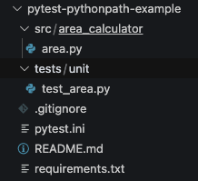
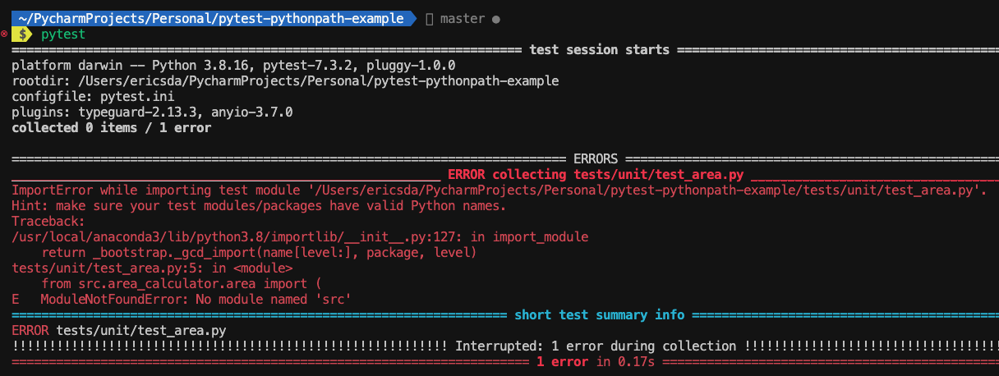
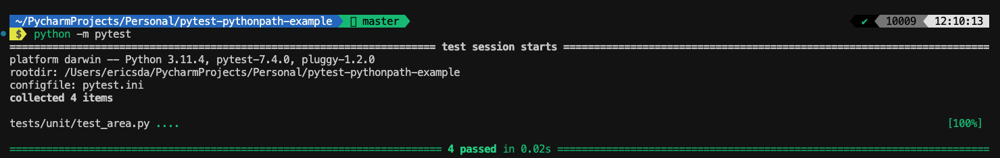
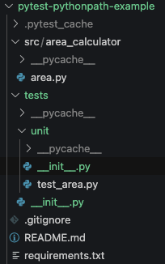
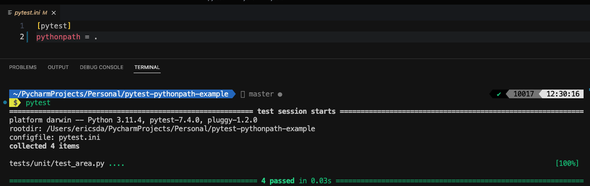

# 4 Proven Ways To Define Pytest PythonPath and Avoid Module Import Errors

As a Python developer, you may face challenges when executing tests, especially with complex directory structures.

Perhaps you faced a `ModuleNotFoundError` or `ImportError`when running your tests and wondering why Pytest cannot import the modules.

An essential part of Pytest’s configuration is managing the Pytest `PYTHONPATH`, which governs how modules and packages are discovered and imported during test execution.

This article will delve into the fundamentals of `PYTHONPATH` configuration with Pytest.

We’ll explore how Pytest identifies and includes test modules, handles package structures, and deals with path-related pitfalls.

With this knowledge, you can optimize your test suites, resolve import errors, and streamline your testing workflow.

Let’s get into it.

[Link To GitHub Repo](https://github.com/lj020326/pytest-pythonpath-example)

## [](#How-Does-Python-Find-The-Execution-Path "How Does Python Find The Execution Path?")How Does Python Find The Execution Path?

Before diving in, we need to understand the basics of how Python finds the execution path.

When executing a Python script, the interpreter examines the directories listed in the `sys.path` variable, which contains a predefined set of locations to search for modules.

The search begins with the directory containing the script, followed by directories specified by the `PYTHONPATH` environment variable (if set).

Next, the interpreter searches within standard library locations and built-in modules.

In addition to these default paths, Python also checks for third-party modules installed in the system-wide Python installation or virtual environments.

The order in which directories are searched determines which module version is imported if multiple versions exist.

This process ensures that Python can locate the necessary modules for efficient execution.

## [](#Objectives "Objectives")Objectives

After reading this article, you should be able to:

-   Gain a basic understanding of how Python finds the execution path
-   Organize your code modules and import them into Pytest for testing
-   Have an understanding of various ways to override the `PYTHONPATH` variable from your unit tests
-   Resolve `ModuleNotFoundErrors` or `ImportErrors`

## [](#Project-Set-Up "Project Set Up")Project Set Up

The project has the following structure.



### [](#Getting-Started "Getting Started")Getting Started

To get started, clone the repo [here](https://github.com/lj020326/pytest-pythonpath-example), or create a folder and running `git init` to initialise your repo.

### [](#Prerequisites "Prerequisites")Prerequisites

To follow this guide, you should have:

-   Python 3.11+ installed (recommend installing via [Conda](https://docs.conda.io/en/latest/)).
-   An elementary grasp of Python and Pytest.

Create a virtual environment and install the requirements (packages) using

<table><tbody><tr><td><pre><span>1</span><br></pre></td><td><pre><span>pip install -r requirements.txt</span><br></pre></td></tr></tbody></table>

## [](#Example-Code "Example Code")Example Code

As always, we start with an example code.

Pay close attention to the folder structure and how the modules are organized, as this is important.

`src/area_calculator/area.py`

```python
"""  
Python code to calculate area of various shapes  
"""  
  
def square(side: float) -> float:  
    """  
    Calculate area of a square  
    """  
    return round(side * side, 2)  
  
def rectangle(length: float, breadth: float) -> float:  
    """  
    Calculate area of a rectangle  
    """  
    return round(length * breadth, 2)  
  
def circle(radius: float) -> float:  
    """  
    Calculate area of a circle  
    """  
    return round(3.14 * radius * radius, 2)  
  
def triangle(base: float, height: float) -> float:  
    """  
    Calculate area of a triangle  
    """  
    return round(0.5 * base * height, 2)

```

Our source code is a simple Area Calculator module that calculates the area for various shares—square, rectangle, circle and triangle.

This is located under `src/area_calculator/area.py`

## [](#Testing-The-Example-Code-ModuleNotFoundError "Testing The Example Code (ModuleNotFoundError)")Testing The Example Code (`ModuleNotFoundError`)

Now that we’ve got some flavour for the example code, it’s time to Unit Test it.

Our test file is called `test_area.py` and is located at

`tests/unit/test_area.py`

```python
from src.area_calculator.area import (  
    square,   
    rectangle,   
    circle,   
    triangle  
)  
  
def test_square():  
    """  
    Test square function  
    """  
    assert square(2) == 4  
    assert square(3) == 9  
    assert square(4) == 16  
  
def test_rectangle():  
    """  
    Test rectangle function  
    """  
    assert rectangle(2, 3) == 6  
    assert rectangle(3, 4) == 12  
    assert rectangle(4, 5) == 20  
  
def test_circle():  
    """  
    Test circle function  
    """  
    assert circle(2) == 12.56  
    assert circle(3) == 28.26  
    assert circle(4) == 50.24  
  
def test_triangle():  
    """  
    Test triangle function  
    """  
    assert triangle(2, 3) == 3  
    assert triangle(3, 4) == 6  
    assert triangle(4, 5) == 10

```

Now let’s try to run the test using the following command, from the root of the repo

```shell
$ pytest
```

We get the following error



`E ModuleNotFoundError: No module named ‘src’`

Let’s take a look at why this happens and how to solve it.

## [](#Run-Pytest-As-A-Module "Run Pytest As A Module")Run Pytest As A Module

The above error occurs because we import the module `src/area_calculator.py` in the tests but Pytest cannot find it.

Now we can treat our test file like a Python module and run

```shell
$ python -m pytest
```

This treats our unit test like a Python Module, looks in the current directory and executes it.



However, even though it works, it’s not very convenient. We want to be able to run `pytest` commands and flags.

## [](#How-To-Specify-Pytest-PYTHONPATH "How To Specify Pytest PYTHONPATH")How To Specify Pytest PYTHONPATH

Let’s look at a few ways we can solve this.

### [](#Use-INIT-Files "Use INIT Files")Use INIT Files

Using `__init__.py` files in the `tests` and `tests/unit` folder allows us to run our tests using the `pytest`command.

While convenient, let’s look at a few more elegant ways we can specify the Pytest Pythonpath, without including a bunch of `__init__.py` files.

This is particularly important if you have source code in several folders spread across the repo and need to import specific files for your unit testing.



### [](#Use-Pytest-Config-Files-%E2%80%94-pytest-ini "Use Pytest Config Files—pytest.ini")Use Pytest Config Files—pytest.ini

As stated above, we often have modules spread across the repo (especially in mono repo projects) and you need to import files from different locations.

Defining custom Python Paths is very useful in this case.

There are a few ways to do this.

Pytest config files are a massive time saver.

It lets you define config and go on without worrying about passing CLI commands or maintaining config within your unit tests.

If you’re unfamiliar with Pytest config—`ini` or `toml` files, [this article introduces Pytest Ini](https://pytest-with-eric.com/pytest-best-practices/pytest-ini/) and the important config options that needs to be set.

`PYTHONPATH` config can be defined like this

`pytest.ini`

```ini
[pytest]  
pythonpath = .

```

The above config tells Pytest to look in the root of the repo.

If you wanted to narrow this down to the `src` folder you could specify

`pytest.ini`

```ini
[pytest]  
pythonpath = src

```

So, when Pytest is executing tests, it will also look in the `src` folder. In that case, in the unit test we could import the module like this (without the `src`)

```python
from area_calculator.area import (
    square, 
    rectangle, 
    circle, 
    triangle
)

```

No need for `__init__.py` files either.

I’m a big fan of importing directories from the root of the repo as most code is run from there.



You can also define one or more directories here for e.g.

```ini
[pytest]  
pythonpath = src1 src2

```

Directories will be added to the head of `sys.path`.

Paths are relative to the rootdir directory and directories remain in the path for the duration of the test session.

Similarly, you can set Environment Variables via `pytest.ini`, this popular article walks you through setting [Pytest environment variables](https://pytest-with-eric.com/pytest-best-practices/pytest-environment-variables/).

Similarly [Pytest Logging](https://pytest-with-eric.com/pytest-best-practices/pytest-logging/) can be set like this.

Besides config files, what other ways can we define the Python Path?

### [](#Define-Pythonpath-In-The-Test "Define Pythonpath In The Test")Define Pythonpath In The Test

A simple other way to define your `PYTHONPATH` is within the test itself.

This can be done by adding the below to the top of your tests (before importing the modules).

Where `src` is the folder where the modules are located.

```python
import sys  
sys.path.append('src')

```

### [](#Use-Environment-Variables "Use Environment Variables")Use Environment Variables

You can also update your PYTHONPATH to include the source module’s directories using the `PYTHONPATH` environment variable.

```shell
export PYTHONPATH="${PYTHONPATH}:/Users/<myuser>/project_root_folder_path"

```

## [](#Conclusion "Conclusion")Conclusion

In this article, we learnt a few ways to define your PYTHONPATH so Pytest can seamlessly pick it up and avoid the annoying `ModuleNotFoundError` .

Several ways to define your Pytest PYTHONPATH include—Pytest config, within the tests and environment variables.

Honestly, my preferred way is to use config files. This restricts you within the Pytest ecosystem and avoids messing with system-wide `PYTHONPATH` changes.

Armed with this knowledge, you should be able to now easily import modules from any location within the repo into your Unit Tests without Import Errors. I hope it’s been helpful.

If you have ideas for improvement or like for me to cover anything specific, please send me a message via [Twitter](https://twitter.com/ericsda), [GitHub](https://github.com/lj020326) or [Email](mailto:sdaeric19@gmail.com).

Till the next time… Cheers!

## [](#Additional-Reading "Additional Reading")Additional Reading

- https://pytest-with-eric.com/introduction/pytest-pythonpath/
- https://docs.pytest.org/en/stable/explanation/pythonpath.html
- https://docs.pytest.org/en/stable/example/simple.html#request-example
- https://docs.pytest.org/en/stable/how-to/fixtures.html
- https://docs.pytest.org/en/stable/example/parametrize.html
- https://docs.pytest.org/en/latest/how-to/fixtures.html#dynamic-scope
- https://docs.pytest.org/en/latest/reference/reference.html#request
- https://www.testrail.com/blog/test-automation-step-three/
- https://www.jenkins.io/blog/2016/10/31/xunit-reporting/
- 
