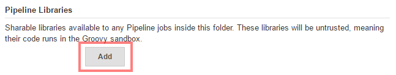
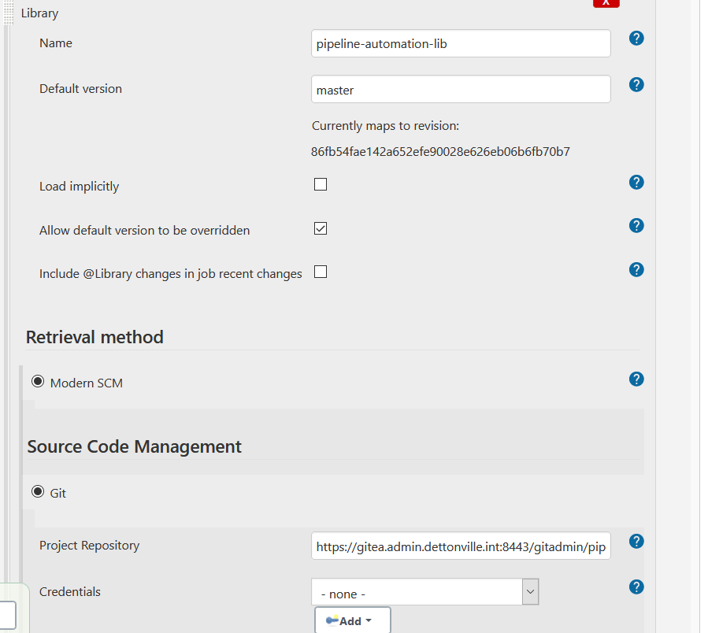

# Setup your Environment for Pipeline library

Create a separate repository containing your pipeline library and add
the configurations there. This will keep your setup clean and ensures
maintainability.

Before you start, it is recommended to read
[Extending with Shared Libraries](https://jenkins.io/doc/book/pipeline/shared-libraries/)
from Jenkins documentation.

# Table of contents
* [Tutorial Background](#tutorial-background)
* [Step 1: Include the Pipeline in your Jenkins instance.](#step-1-include-the-pipeline-in-your-jenkins-instance)
* [Step 2: Use the library in a job](#step-2-use-the-library-in-a-job)


## Tutorial Background

In this tutorial we assume the following:

You have project level admin access with respect to the following components:

* cd.dettonville.int - Jenkins Instance

## Step 1: Include the Shared Pipeline in your Jenkins instance.

There are several ways to include the shared library in your Jenkins instance:

* Global Shared Pipeline Library
* Folder based Shared Pipeline Library
* Project based Shared Pipeline Library
* Dynamic loading from SCM within your pipeline script.

Here we use the project based shared library approach.

* Goto https://cd.dettonville.int/jenkins/job/[project-name].
* In the configure screen click on "Add" in the Pipeline Libraries
  section.
   and
  configure the pipeline as in the following screenshot:
  
* Explanation:
  * Name = `pipeline-library`
    You can of course use your own library name here.  If doing so, make sure to change all library references in the following instructs.
  * Default Version = `master` (use either master or a tag)
    You may also refer to a specific library by tag/branch/commitRef - @Library('somelib@<tag/branch/commitRef>')
    E.g., @Library('pipeline-library@2.0.0-SNAPSHOT')
  * Retrieval Method is `Modern SCM` and we are checking out from a git
    repository
  * Make sure to check `Ignore on push notifications`, enable `Don't
    trigger a build on commit notifications` and add `Advanced clone
    behaviors` with `Shallow clone` enabled
  * The GIT extensions ensure that a new master version of the pipeline
    library will not
    * make your Jenkins going crazy by building every using job with an SCM
      trigger
    * show the changelog of the pipeline library in your using jobs

## Step 2: Use the library in a job

* Goto https://cd.dettonville.int/jenkins/job/[project-name].
* Create a new Pipeline job named 'Demo'
* Add the following script in the Pipeline script field:
  ```groovy
   @Library ('pipeline-library')

   import com.dettonville.api.pipeline.utils.logging.*

   Logger.init(steps, LogLevel.INFO)
   Logger log = new Logger(this)

   log.info("This is an info log from the pipeline library")      
  ```
* run the job

You should see some checkout logs and at the end of the job the follwing
output:

```text
[Pipeline] echo
[INFO] WorkflowScript : This is an info log from the pipeline library
[Pipeline] End of Pipeline
Finished: SUCCESS
```

Congratulations, you are now ready to use the pipeline library

